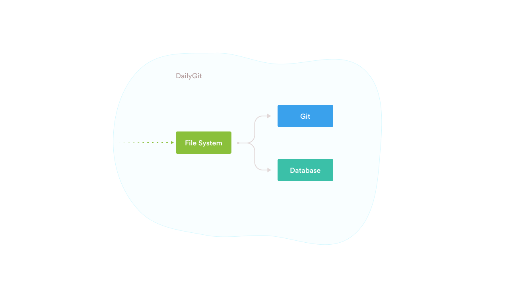

import {Pagination} from '../src/components'

# Introduction

DailyGit is platform that provides you the powerful tools to build your own CMS(Content Management System). DailyGit comes built in with version control, filesystem and database for storing files metadata.

<Pagination next={{name: "Filesystem - Create File", link: "/filesystem/create"}}/>